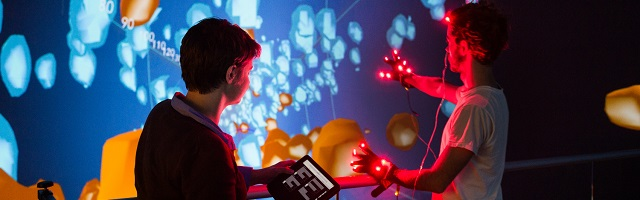
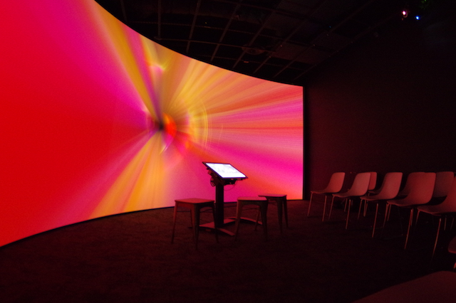

AlloSphere Research Group
=========================

-   Multi-projector (26) VR environment
-   Distributed stereoscopic rendering
-   Multi-channel (54.1) spatializaed audio

From Wikipedia [1]:

> "The AlloSphere includes a three-story cube that has been insulated extensively with sound-absorbing material, making it one of the largest echo-less chambers in the world. Within the chamber are two hemispheres of 5 meter radii, made of perforated aluminum. These are opaque and acoustically transparent."

I've been working at AlloSphere Research Group [2] from 2015 to 2018, as a graduate student researcher. I was involved in projects such as TEM/AP Visualization or Electron wavefunction visualization & sonification, and I also worked as the main developer for the codebase of the AlloSphere research group: Allolib. I worked on every part of the codebase especially the built system and stereoscopic rendering pipeline for projection mappings.

*Web GUI and Gesture based control interface for AlloSphere*

*AlloPortal, a smaller scale curved projection environment built with AlloSphere technology*

---

1. <https://en.wikipedia.org/wiki/AlloSphere>
2. <http://www.allosphere.ucsb.edu>