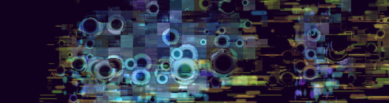

Balanced Movement
=================

-   Realtime audiovisual, Custom C++ software
-   Curved screen projection with 2 projectors

Through stochastic process, a dynamic equilibrium can be achieved. By transition between three different action states (generation, modifcation, and destruction) governed by transition probability matrix, canvas continuously changes. However, the overall chracteristic determined by the transition probability matrix is maintained throughout the process. Different visual styles are tested but the idea in common is generation as horizontal component, modification as vertical component, and destruction as circular and erasing component.

Video: <https://vimeo.com/181492060>

In 2019 a second iteration of Balanced Movement was created with a fixed length composition. Visual style was changed and the software was modified to show the work on a curved projection screen. Balanced Movement was exhibited at the Media Arts and Technology End of Year Show 2019, UC Santa Barbara.

