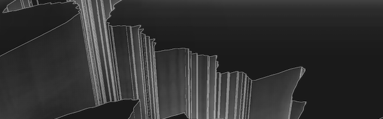

Reconstruction
==============

Reconstruction tries to generate virtual geographical shapes from spectrum of frequencies that are observed from static materials such as image. The characteristic function written for this work takes a spectrum and returns a procedurally generated shape. The function mostly focuses on re-interpretation of spectrum into other dimensions, units, or parameters, while also taking consideration in fractal-like nature of geographic geometries. With generated shape, a short audio visual composition is presented, utilizing different rendering styles and camera position/movement.

Video: <https://vimeo.com/268367559>

